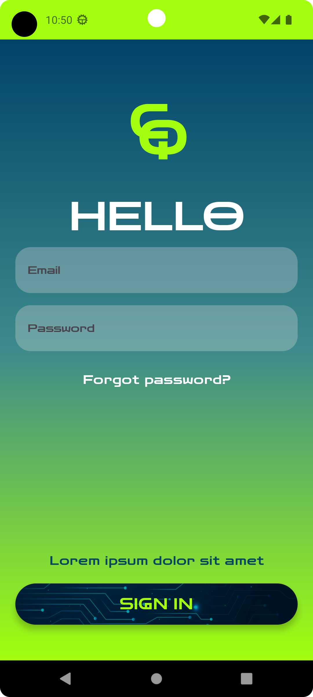

# Code Quiz Application

## Description
This mobile application enables users to compete against each other by taking quizzes related to programming and IT technology. The application uses modern practices and technologies to provide a seamless and engaging user experience.

## Technologies I am using currently
- **Jetpack Compose**: For building the UI.
- **Hilt**: For dependency injection.
- **Jetpack Compose Navigation**: For navigation between screens.
- **Firebase**:
  - **Firebase Database**: For real-time data.
  - **Firebase Firestore**: For storing quiz data and user information.
  - **Firebase Authentication**: For user authentication.
- **MVVM Architecture**: Model-View-ViewModel architecture for separation of concerns.
- **Clean Architecture**: Implementation of use cases to maintain a clean code structure.

     
     
  

  
## The application building is in progress.
Every day I am making few changes in the code. So far I have done quite good job, but still its is large amount of work ahead me. 
